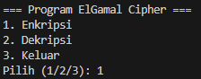
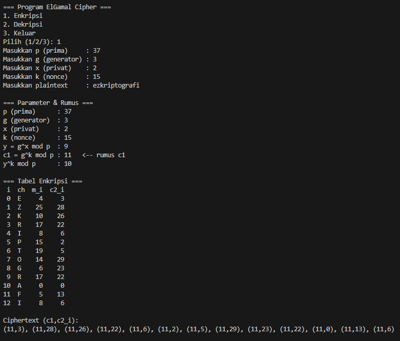
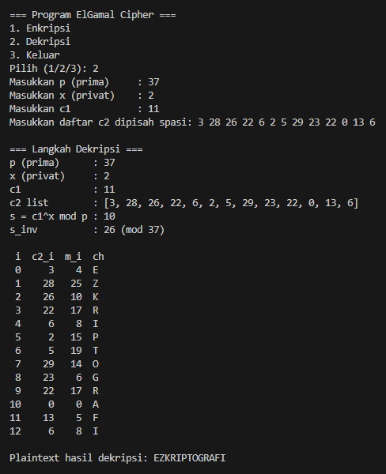

# ElGamal Cipher

## Identitas
**Nama** : Muhammad Zahran Muntazar  
**NPM**  : 140810230014  

## Deskripsi Program
Program ini merupakan implementasi **ElGamal Cipher** dalam bahasa Python dengan dua fitur utama: **Enkripsi** dan **Dekripsi**.  
Plaintext hanya menerima huruf A–Z (otomatis diubah menjadi huruf kapital dan spasi dihapus). Hasil enkripsi berupa pasangan ciphertext `(c1, c2_i)`.

## Rumus Utama

### Enkripsi
1. Hitung kunci publik:  
   \[y = g^x mod p\]

2. Hitung nilai tetap:  
   \[c1 = g^k mod p\]

3. Untuk setiap huruf plaintext \(m_i\):  
   \[c2_i = m_i . (y^k) mod p\]

4. Ciphertext akhir berupa pasangan:  
   \[(c1, c2_1), (c1, c2_2), ... , (c1, c2_n)\]

### Dekripsi
1. Hitung shared secret:  
   \[ s = c1^x mod p\]

2. Cari invers modular dari \(s\):  
   \[s^{-1} mod p\]

3. Pulihkan setiap huruf plaintext:  
   \[m_i = c2_i . s^{-1} mod p\]

4. Gabungkan semua \(m_i\) untuk mendapatkan plaintext asli.

## Alur Program
1. Program menampilkan **menu utama**.  
2. Pengguna memilih opsi:  
   - `1` → Enkripsi  
   - `2` → Dekripsi  
   - `3` → Keluar  
3. Jika memilih **Enkripsi**:
   - Masukkan parameter `p, g, x, k, plaintext`.  
   - Program menampilkan nilai `y`, `c1`, serta daftar pasangan `(c1, c2_i)`.  
4. Jika memilih **Dekripsi**:
   - Masukkan parameter `p, x, c1`, dan daftar `c2` (dipisah spasi).  
   - Program menghitung `s`, `s_inv`, lalu menampilkan hasil **plaintext**.  
5. Setelah selesai, hasil enkripsi atau dekripsi ditampilkan, dan program kembali ke menu utama.

## Screenshot Running Program
### Menu Utama

### Enkripsi

### Deskripsi

