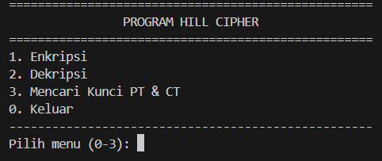
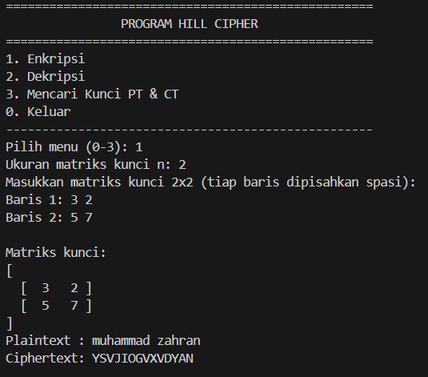
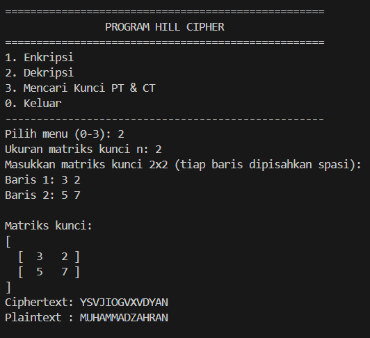
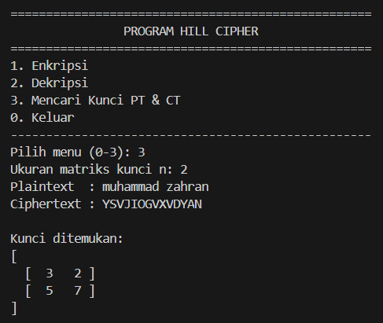

# Program Hill Cipher 

## Identitas
- **Nama**  : Muhammad Zahran Muntazar
- **NPM**   : 140810230014

## Instalasi & Menjalankan Program
### Prasyarat
- Python 3.8+  
- Library: `numpy`

```bash
pip install numpy
```
### Menjalankan Program
Simpan sumber kode sebagai hill_cipher.py lalu jalankan:

```bash
python hill_cipher.py
```

## ✨ Fitur Utama
Program ini merupakan implementasi algoritma Hill Cipher dengan tiga fitur utama:

### 🔒 Enkripsi
- Pengguna memasukkan **plaintext** dan **matriks kunci**.
- Plaintext dipecah menjadi blok sesuai ukuran matriks.
- Setiap blok dikalikan dengan matriks kunci (mod 26) untuk menghasilkan **ciphertext**.

### 🔓 Dekripsi
- Pengguna memasukkan **ciphertext** dan **matriks kunci**.
- Program menghitung **determinan** matriks kunci, mencari **invers modulo 26**, lalu menyusun **invers matriks kunci**.
- Ciphertext dikalikan dengan matriks invers untuk mendapatkan kembali **plaintext**.

### 🔑 Pencarian Kunci dari Pasangan Plaintext & Ciphertext
- Pengguna memasukkan pasangan **plaintext** dan **ciphertext** dengan panjang minimal **n² huruf** (untuk kunci n×n).
- Program membangun matriks dari plaintext dan ciphertext, memilih submatriks yang dapat diinversi, lalu menghitung kunci dengan rumus:
  K ≡ C · P⁻¹ (mod 26)


## 💻 Alur Kerja Program
## Alur Program

1. **Mulai program**
   - Tampilkan judul dan menu utama.

2. **Tampilkan Menu Utama**

3. **Input pilihan menu**

- Jika **1 → Enkripsi**:
  - Input ukuran matriks `n`.
  - Input matriks kunci (per baris).
  - Input plaintext.
  - Konversi plaintext → angka.
  - Bagi menjadi blok ukuran `n`.
  - Kalikan blok dengan matriks kunci (mod 26).
  - Gabungkan hasil menjadi ciphertext.
  - Tampilkan ciphertext.

- Jika **2 → Deskripsi**:
  - Input ukuran matriks `n`.
  - Input matriks kunci (per baris).
  - Input ciphertext.
  - Hitung determinan kunci.
  - Cari invers determinan (mod 26).
  - Susun invers matriks kunci (mod 26).
  - Kalikan ciphertext dengan matriks invers (mod 26).
  - Gabungkan hasil menjadi plaintext.
  - Tampilkan plaintext.

- Jika **3 → Mencari Kunci PT & CT**:
  - Input ukuran matriks `n`.
  - Input plaintext & ciphertext (≥ n² huruf).
  - Bangun matriks P dan C dari blok teks.
  - Cari submatriks P yang invertible (mod 26).
  - Hitung K = C · P⁻¹ (mod 26).
  - Tampilkan matriks kunci.

- Jika **0 → Keluar**:
  - Program berhenti.

4. **Kembali ke menu utama** (selama tidak memilih keluar).

5. **Selesai**

## 📊 Screenshot Running Program
### Menu Utama


### Enkripsi


### Deskripsi


### Cari Kunci


## ⚠️ Catatan Penting
- Pastikan input plaintext/ciphertext panjangnya sesuai dengan ukuran kunci.
