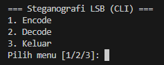
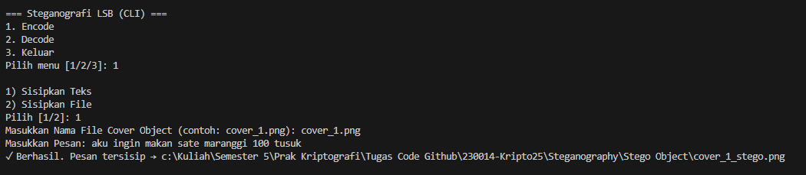
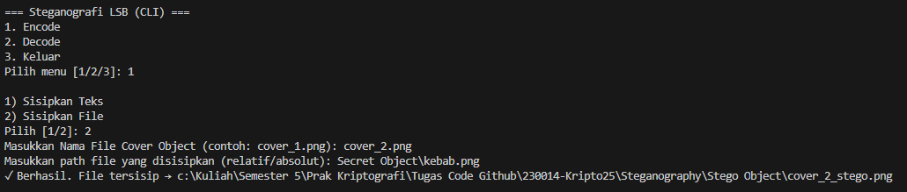
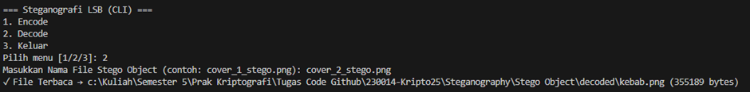

# Steganography LSB (Python)

## Identitas
**Nama**  : Muhammad Zahran Muntazar
**NPM**   : 140810230014

---

## Deskripsi Program
Program ini adalah implementasi **steganografi metode Least Significant Bit (LSB)** menggunakan **Python**. Aplikasi menyediakan menu CLI untuk:
- **Encode**: menyisipkan **teks** atau **file (payload)** ke dalam **Cover Object** dan menghasilkan **Stego Object (PNG)**.
- **Decode**: mengekstrak kembali **teks** atau **file** dari **Stego Object**.
Algoritma memakai **2 LSB per kanal RGB** (6 bit/piksel) sehingga kapasitas besar dengan perubahan visual yang minim. 
**Disarankan menggunakan format PNG (lossless).**

## Struktur Folder
```
Steganography/
├─ Cover Object/        # folder input gambar cover (PNG/BMP disarankan)
├─ Secret Object/       # (opsional) file/pesan yang akan disisipkan (payload)
├─ Stego Object/        # hasil encode (stego) + hasil decode (subfolder decoded/)
│  └─ decoded/          # output file saat decode (jika payload = file)
├─ screenshots/         # (opsional) bukti running/screenshot
├─ LSB.py               # file program utama (menu + CLI argumen)
└─ README.md            # dokumentasi
```

---

## Cara Menjalankan
1. Pastikan sudah menginstall **Pillow**:
   ```bash
   pip install pillow
   ```

2. Jalankan program:
   ```bash
   python LSB.py
   ```

3. Ikuti menu interaktif:
   - Pilih `1` untuk Encode.
   - Pilih `2` untuk Decode.
   - Pilih `3` untuk Keluar.

---

## Alur Program
1. **Menu Utama**
   - Pilih **1** untuk **Encode**.  
   - Pilih **2** untuk **Decode**.  
   - Pilih **3** untuk **Keluar**.  
   *Setelah selesai encode/decode, program kembali ke menu hingga kamu memilih Keluar.*


2. **Encode**
   - Pilih jenis payload:
      - **(1) Sisipkan Teks** → ketik pesan.
      - **(2) Sisipkan File** → masukkan path file (**relatif** atau **absolut**).
   - Masukkan **nama/path cover** dari folder **Cover Object**  
     (misal: `cover_1.png` atau `C:\...\Cover Object\cover_1.png`).
   - **Output otomatis** disimpan sebagai:  
     `Stego Object/<nama_cover>_stego.png`

3. **Decode**
   - Masukkan **nama/path** gambar stego dari folder **Stego Object**  
     (misal: `cover_1_stego.png`).
   - Jika payload **teks** → ditampilkan di terminal.  
     Jika payload **file** → disimpan ke `Stego Object/decoded/` dengan **nama asli**.

## Screenshot Running Program
### Menu Utama


### Encode Teks


### Decode Teks


### Encode Gambar


### Decode Gambar

