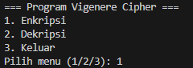
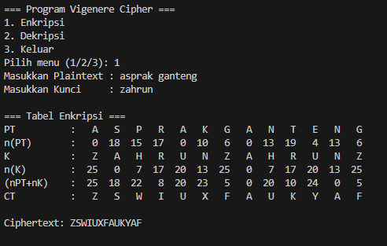
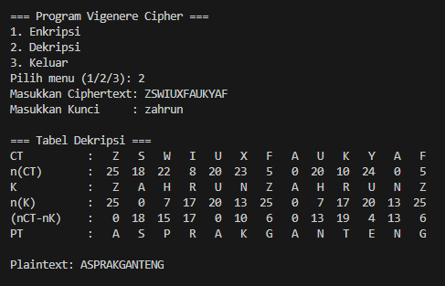

# Vigenere Cipher

## Identitas
**Nama**  : Muhammad Zahran Muntazar
**NPM**   : 140810230014

## Deskripsi Program
Program ini adalah implementasi **Vigenere Cipher** dalam bahasa Python. Program menyediakan menu untuk melakukan **enkripsi** dan **dekripsi** teks menggunakan kunci tertentu. Semua huruf otomatis diubah menjadi huruf kapital, dan spasi dihapus agar sesuai dengan aturan klasik cipher.

## Alur Program
1. **Menu Utama**
   - Pilih `1` untuk enkripsi.
   - Pilih `2` untuk dekripsi.
   - Pilih `3` untuk keluar dari program.

2. **Enkripsi**
   - Masukkan plaintext (contoh: `HELLO WORLD`).
   - Masukkan kunci (contoh: `KEY`).
   - Program akan mengubah plaintext → ciphertext dengan rumus:  
     ```
     C = (P + K) mod 26
     ```

3. **Dekripsi**
   - Masukkan ciphertext (contoh: `RIJVSUYVJN`).
   - Masukkan kunci yang sama (contoh: `KEY`).
   - Program akan mengembalikan ciphertext → plaintext dengan rumus:  
     ```
     P = (C - K) mod 26
     ```

## Screenshot Running Program
### Menu Utama


### Enkripsi


### Deskripsi

